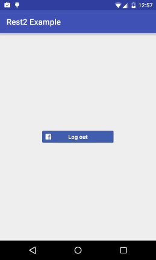
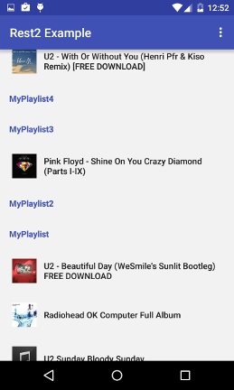

Facebook & SoundCloud integration

External libraries used include:
-Picasso
-Retrofit (need to be upgraded to Retrofit 2.0)
-Sectioned RecyclerView by project https://github.com/luizgrp/SectionedRecyclerViewAdapter
-Facebook SDK
-SoundCloud api

